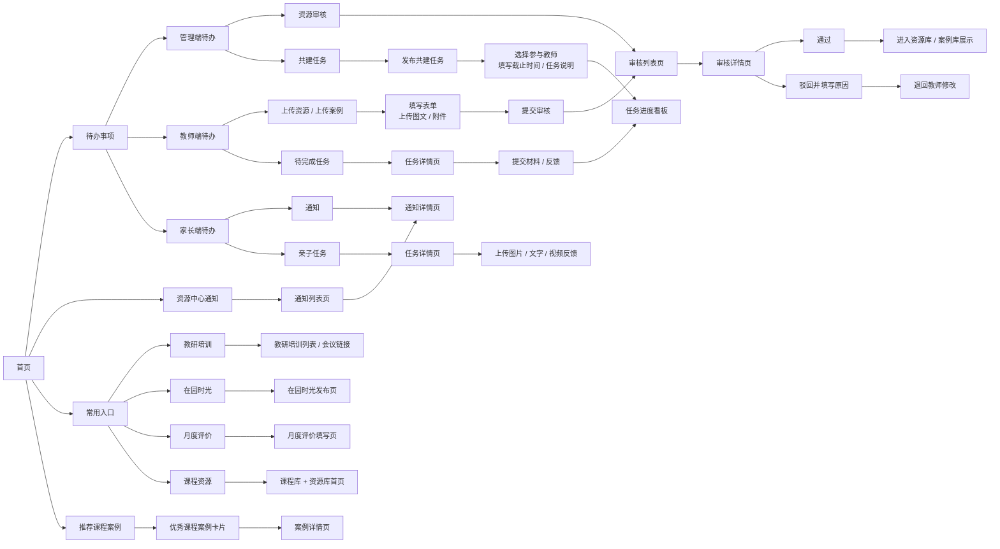
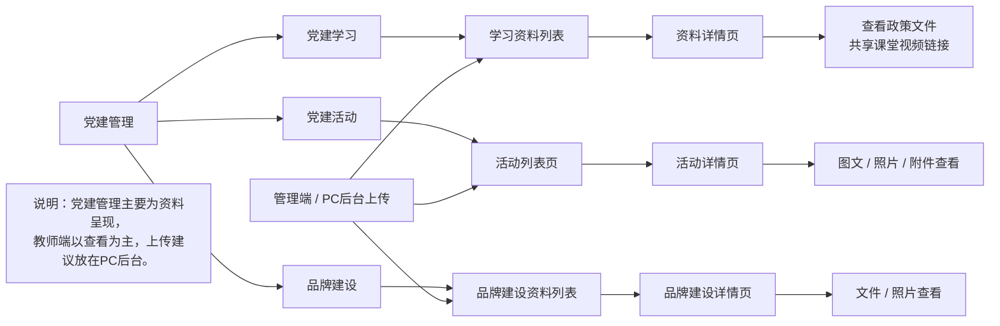
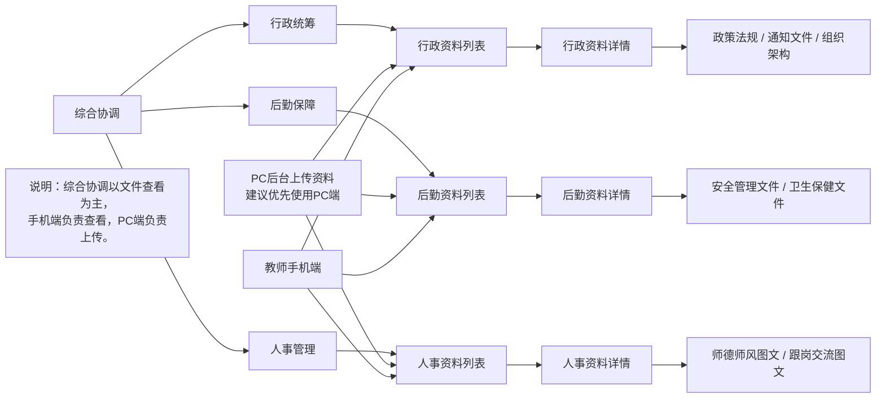
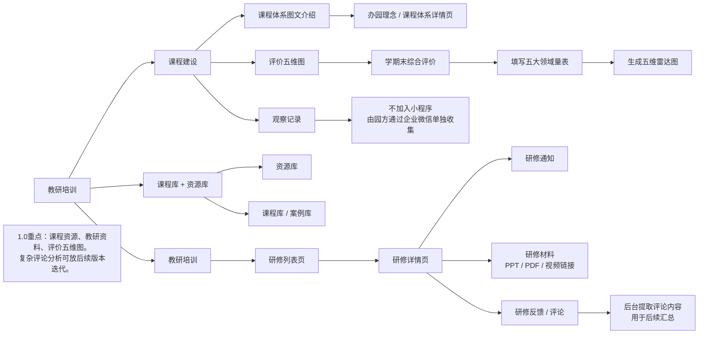
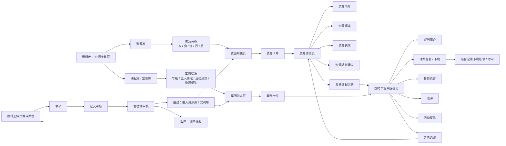
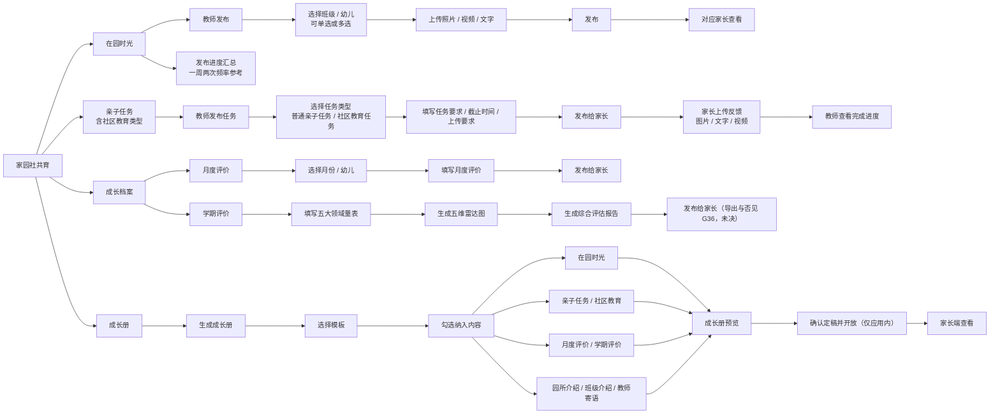
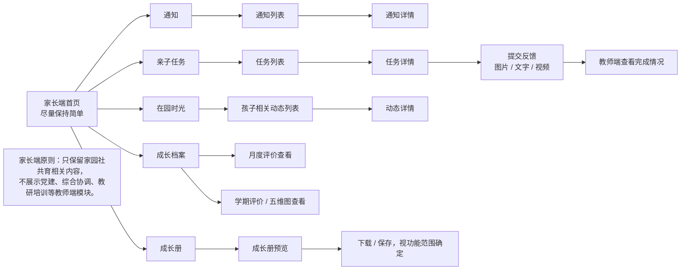
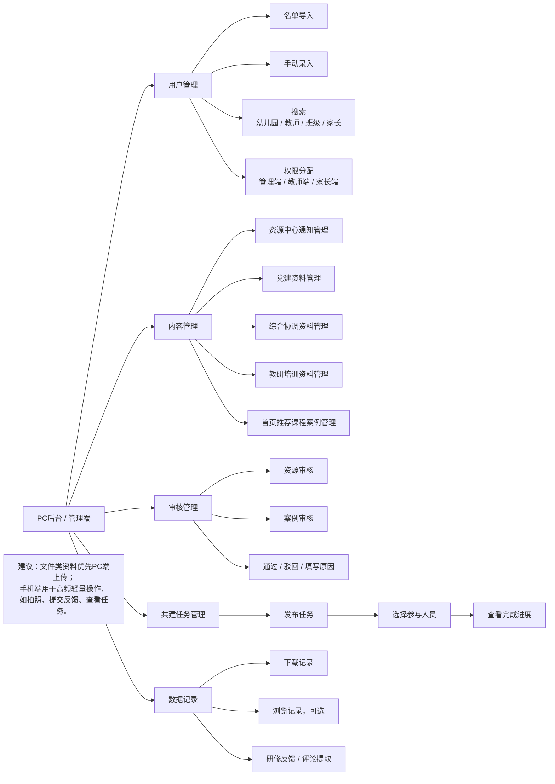

# APP-STRUCTURE.md — Agreed app structure (1:1 with the source flowcharts)

> This is the **structural source of truth**. The Mermaid charts below are a **1:1 mirror** of
> `Platform Flow.txt` (kept verbatim for consultation and rendered on the docs site). The machine-readable
> contract derived from them is [`harness/structure/app-structure.json`](../harness/structure/app-structure.json),
> which the **structure judge** (`harness/judges/structure_judge.py`) enforces: when application code drifts
> from this structure, the commit is blocked with a reminder to correct.
>
> 本文件是结构的唯一真相。下方 Mermaid 图为 `Platform Flow.txt` 的 1:1 镜像（逐字保留，供查阅并在文档站渲染）。由其派生的机器可读契约为 `harness/structure/app-structure.json`，由结构评审强制校验：代码与结构不符时阻断提交并提示纠正。
>
> When the agreed structure changes, edit **both** this file and `app-structure.json` in the same commit.

## Surfaces and role access / 端与角色权限

| Surface / 端 | admin 管理端 | teacher 教师端 | parent 家长端 |
|---|---|---|---|
| Mini Program — staff modules (党建/综合协调/教研培训/资源库/案例库) | Yes | Yes | **No** |
| Mini Program — 家园社共育 + 首页/通知 | Yes | Yes | Yes (own child only) |
| **PC backend / CMS (PC后台)** | **Yes** | **No** | **No** |

There are **exactly two Mini Programs** this cycle — 教师端 and 家长端. There is **no admin Mini Program**:
the admin role acts through the teacher client for content management and uses the PC后台 for cross-class
work. The rows above describe module access by role, not a separate admin app.

Key rule confirmed: the **PC backend / CMS is admin-only**. Teachers and parents have **no CMS access** in the
current scope. The parent client surfaces only home-school-community co-education content plus its own notices
and tasks; it never renders staff modules. See [ADR-0002](adr/0002-co-education-naming.md) for the canonical
module name (家园社共育, including 社 / community; the flowchart title `家园共育` is the legacy name).

## Module map / 模块地图

1. 首页 Home — flowchart 01
2. 党建管理 Party-building management — flowchart 02
3. 综合协调 Administrative coordination — flowchart 03
4. 教研培训 Teaching-research and training — flowchart 04
5. 资源库 + 案例库 Resource library + Case library — flowchart 05
6. 家园社共育 Home-school-community co-education — flowchart 06
7. 家长端 Parent client — flowchart 07
8. PC后台 PC backend — flowchart 08

---

## 01 · 首页 Home

## 02 · 党建管理 Party-building management

## 03 · 综合协调 Administrative coordination

## 04 · 教研培训 Teaching-research and training

## 05 · 资源库 + 案例库 Resource library + Case library

## 06 · 家园社共育 Home-school-community co-education

> Source title in `Platform Flow.txt` reads `家园共育总交互逻辑` (legacy); the canonical module name is
> 家园社共育 — see [ADR-0002](adr/0002-co-education-naming.md).

> **成长册自 F17 起仅在应用内。** 不出 PDF、不出图片册、不可下载、不可分享、不做服务端渲染；上图的
> "确认定稿并开放" 指状态由 `b1` 迁移到 `b2`，而非产出文件。评估报告的导出（`ExportReport`）是另一回事，
> 目前记为未决缺口 G36，本文不予判定。

## 07 · 家长端 Parent client

## 08 · PC后台 / 管理端 PC backend

---

## Structural invariants (enforced) / 结构不变量（强制）

These are mirrored in `harness/structure/app-structure.json` and checked by the structure judge:

1. Every UGC-write screen routes writes through the content-moderation gate before content is visible (ADR-0005).
2. The parent client cannot reach party-building, administrative coordination, teaching-research, or the libraries.
3. The PC backend / CMS is reachable only by admin; teacher and parent have no route into it.
4. Observation records (观察记录) are out of scope and must not appear as a screen (collected via WeCom).
5. 家园社共育 is canonical; the legacy name must not appear as a module or screen name.

## How conformance is checked / 如何校验

- Contract: [`harness/structure/app-structure.json`](../harness/structure/app-structure.json) (screen ids mirror the node ids above).
- Route map: `harness/structure/route-map.json` maps each screen id to a real page path once the app exists.
- Judge: `harness/judges/structure_judge.py` runs inside `npm run gate`. With no app code it passes with a note; once `pages.json`/`app.json` exists it blocks on missing required pages, role-access violations, and UGC paths lacking moderation.
- Truth refresh: run `/understand-anything:understand` to rebuild `.understand-anything/knowledge-graph.json`; the judge and reviewers use it to compare the live codebase map against this structure.
